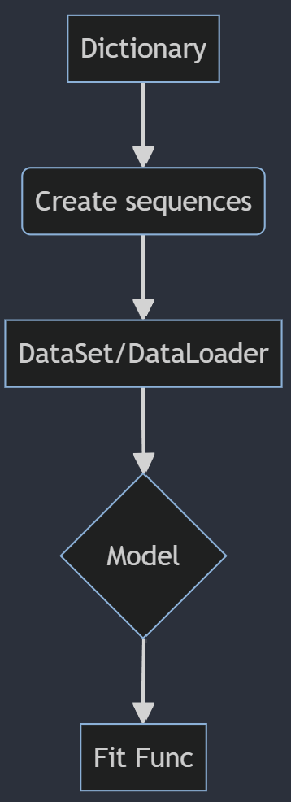

## Embedding and Recurrent Neural Network training for text classification

The following repository contains the code for the CBOW Encodding training, and as a separate project the code for the training process of a graph composed of an embedding and a Recurrent Neural Network (RNN). The letter solving a many to one text classification problem.

### File structure
The files contained on this repository can be accessed through the following [google drive folder](https://drive.google.com/drive/folders/14oKrpv94ZtXfU6UZMA4QmwsUJL8l139u?usp=sharing).

The repository has the following structure:

```
├───Embedding
│   └───cbow_model.py
│       data_loader.py
│       data_set.py
│       embedding_dictionary.py
│       embedding_sequence.py
│       fit_func.py
│       TrainCBOW.ipynb
│       TestCBOW.ipynb
│   
├───Recursive_NN_Reviews
│    └───data_loader.py
│        data_set.py
│        embedding_dictionary.py
│        embedding_sequence.py
│        fit_func.py
│        sequencial_model.py
│        TrainSequentail.ipynb
│        TestSequential.ipynb
├───README.md
```

- Both projects contain `data_set.py` and `data_set.py` for the data dosing process.

- The vocabulary is created in `embedding_dictionary.py` and it will be used to convert tokens to sequences for the training process. The sequences are created in `embedding_sequence.py`. Depending on the problem it creates either windows of text or padded phrases for the model input.

- The `fit_func.py` file contains the class to batch size, train and evaluate the model.

- `cbow_model.py` contains the model used for the embedding creation.

- `sequential_model.py` contains the embedding-RNN graph




### Description

Two approximations were used to train the CBOW model:
1. The usage of an embedding layer was used. The input and output where dosed as vocabulary sized one-hot vectors.

2. As inthe previous approxiamation, a embedding layer was used. The input was dosed as a sequence of integers. The output was set as a on-hot vector.


The Joint graph problem architecture was built in the following manner:

- An embedding layer followed by a LSTM layer were put together. To solve the classification problem, the last output of the LSTM was inputed to a linear layeer with the corresponding dimension to latter be solved by cross entropy loss.

All problems were trained for 500 epochs and the best results were saved based on the validation dataset.

### Results

`Embeddings`:

The following results represent the metrics meassured for the validation dataset. No test set was used.

| Approximation | Accuracy | Recall | AUROC |
|---------------|----------|--------|-------|
| First         | 0.1130   | 0.9923 | 0.8887|
| Second        | 0.0640   | N/A    | N/A   |

`Join-Graph`:

For the join-graph problem. The multiclass accuracy was measured for the test set.

| Metric   | Value |
|----------|-------|
| Accuracy | 0.6038|
| AUROC    | 0.7482|
| Recall Class1 | 0.0000|
| Recall Class2 | 0.0000|
| Recall Class3 | 0.6312|
| Recall Class4 | 0.1426|
| Recall Class5 | 0.8942|

### Discution

It was observed that the embedding problem was very complicated. This might be related to the dimensionality of the input and output vectors. More test are needed to find a decisive conclusion.

The joint-graph problem showed a plateau in accuracy at around ~0.55 for all trainings. Which could indicate a lack of example diversity or data unbalanced as could showed in the results.