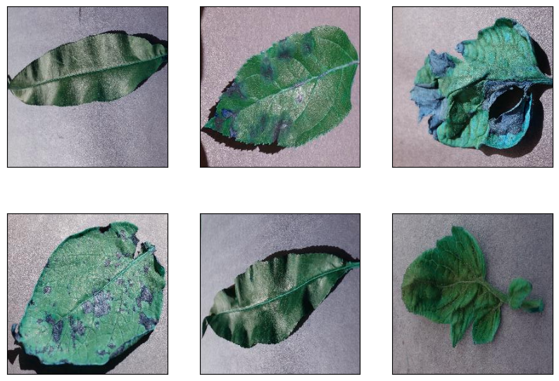
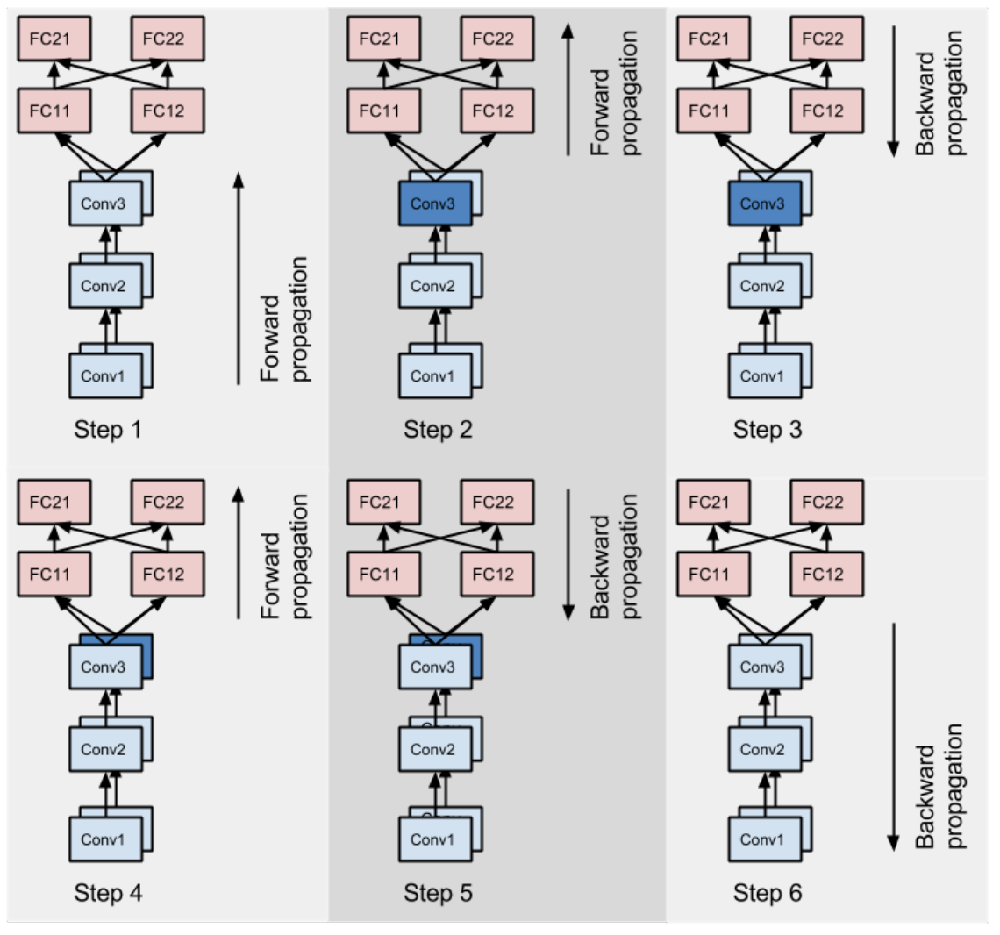
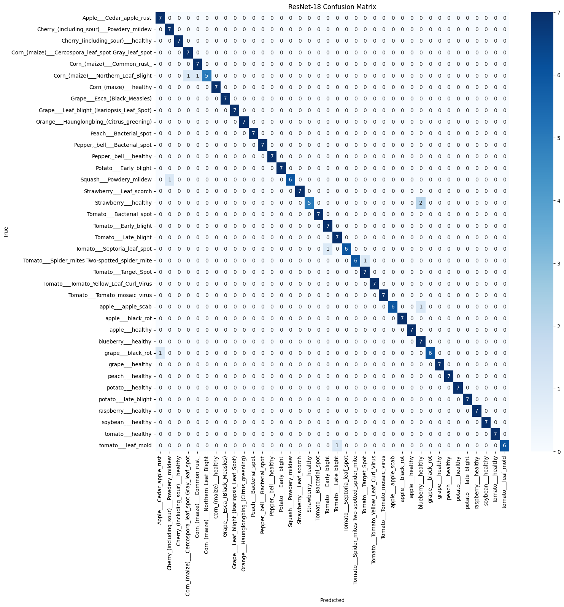
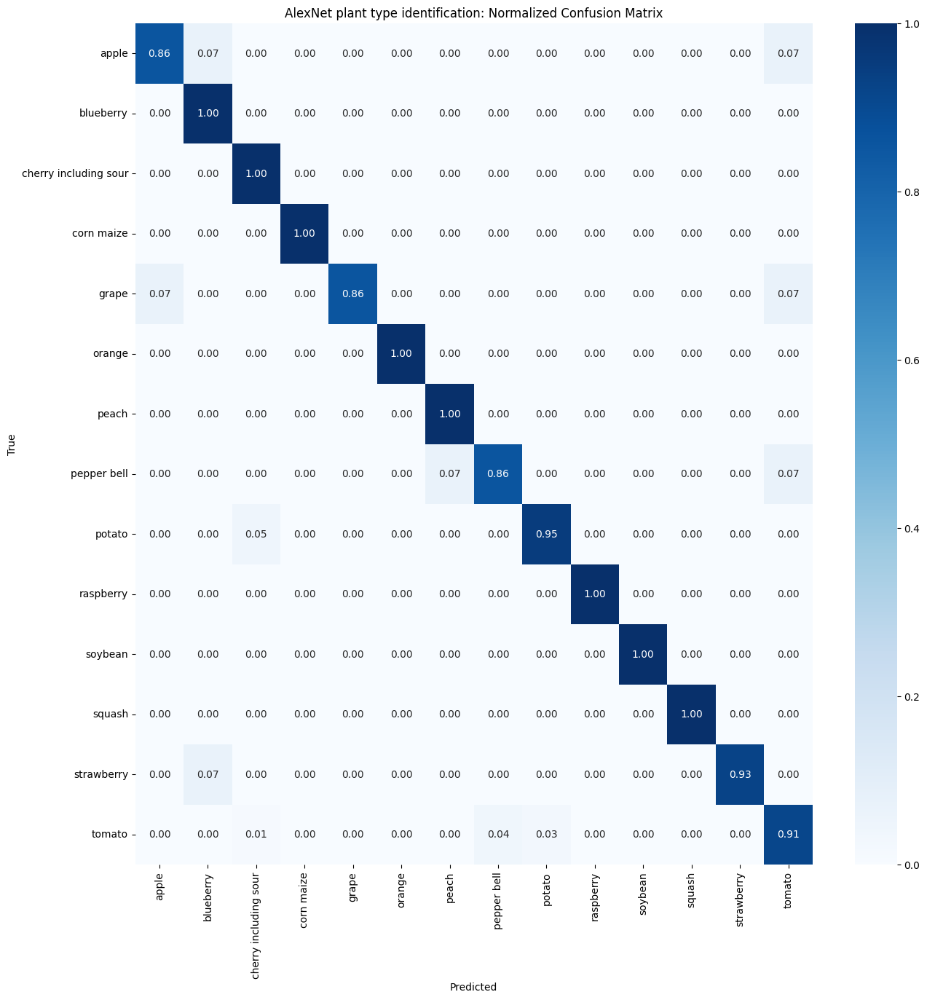
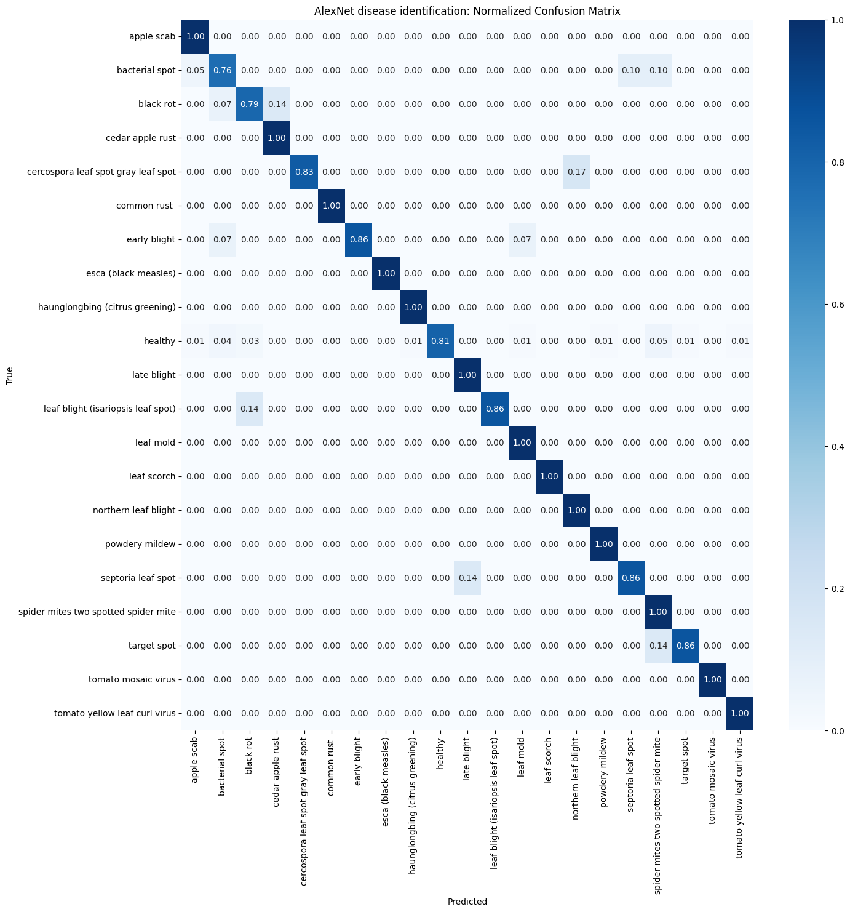

<!-- <h1 style="text-align: center;">Plant leaf and disease identification using deep learning models </h1> -->

\title{Plant leaf and disease identification using deep learning models}
\maketitle

<!-- 
Deep Learning
 -->

\begin{center}
Deep Learning
\end{center}

<!-- 
Gregorio Alvarez
 -->

\begin{center}
Gregorio Alvarez
\end{center}

<!-- 

 -->

\clearpage

### Introduction

The purpose of this report is to conduct a comprehensive analysis of the efficacy of various deep learning models in addressing classification challenges, with a particular focus on the identification of 14 distinct plant species and the detection of 20 prevalent diseases, as well as recognizing healthy specimens. Our analysis will delve into the performance metrics of different model architectures and training methodologies. We aim to compare the effectiveness of a unified model approach, which tackles both classification tasks simultaneously, against the strategy of deploying separate models dedicated to each specific problem. This study will provide insights into the models' predictive capabilities, offering guidance for future research and practical applications in the field of automated plant disease diagnosis and species classification.

### Data Description

The dataset employed in this analysis was accessed through a provided hyperlink and subsequently stored on Google Drive to streamline its management within Google Colab environments. The option of woking with segmented, grayscale, or colored images was given. For the purposes of this study, the selected dataset comprises 54,306 RGB images in JPG format, each with dimensions of 224 x 224 pixels. Below is a sample of the dataset, illustrating the folder structure and corresponding metadata:

| Folder Name                | Leaf Type   | Health Status |
|----------------------------|-------------|---------------|
| apple___apple_scab         | Apple       | Unhealthy     |
| apple___healthy            | Apple       | Healthy       |
| blueberry___healthy        | Blueberry   | Healthy       |
| Strawberry___Leaf_scorch   | Strawberry  | Unhealthy     |

For the construction of the test dataset, 7 images from each of the 38 distinct classes were selected, resulting in a total of 266 images, which constitute approximately 2% of the entire dataset. 

The methodology for dividing the dataset into training and validation subsets will be detailed in the subsequent section.

### Methods

To ensure a thorough analysis of the dataset, we first assessed the number of images within each folder, noting significant variability ranging from as few as 200 images to over 5,000 for the more extensive categories. To address this imbalance, we implemented a weighted sampling technique during the data loading phase, assigning sampling weights inversely proportional to the class frequency, thereby facilitating a more balanced representation of classes during model training.

#### ResNet-18: Joint Classification Approach

Our study incorporated the ResNet architecture, which employs residual learning to facilitate the training of deep neural networks. Initially, we explored the 34-layer configuration as proposed by He et al. (2015). However, our primary focus shifted to an 18-layer variant of ResNet, which introduced a dropout layer at the conclusion of each residual block to mitigate overfitting. This modification is graphically represented by the transition from blue to gray blocks in the accompanying diagram. The 18-layer version demonstrated superior performance on the test set after a single iteration, warranting a more detailed examination.

We used PyTorch's `ImageFolder` to load the images and employed a `DataLoader` to distribute the images across the training, validation, and test phases. To enhance the model's robustness and prevent overfitting, we applied a series of geometric and photometric augmentations as part of our data augmentation strategy.

#### AlexNet: Individual Classification Tasks

For the task-specific models, we configured an AlexNet neural network, adhering to the architecture outlined in the official PyTorch documentation. We instantiated separate AlexNet models for each classification task—one focusing on leaf type identification and the other on disease detection.

We designed two custom dataset loaders to process the images for their respective classification tasks, ensuring that each image was labeled with the appropriate leaf type or disease state. In line with the approach taken for the ResNet-18 model, we adjusted the data sampling strategy during training to account for class size discrepancies, using weights to balance the distribution of data across different classes.

### Training Procedures

#### ResNet-18 Training

For both the joint and individual classification tasks, the ResNet-18 models underwent a training process spanning 40 epochs. Model checkpoints were saved based on the highest global multiclass accuracy achieved on the validation set, ensuring the retention of the most performant models.

The optimal learning rate for the ResNet-18 models was determined to be 0.0001. This value was fine-tuned following a series of preliminary runs to identify the learning rate that facilitated the best convergence behavior.

As for the loss function, we utilized cross-entropy loss combined with logarithmic softmax. This approach is particularly effective in multiclass classification problems, such as ours, which involved distinguishing between 38 different classes.

#### AlexNet Training

The training of the AlexNet models was conducted with a learning rate of 0.001, which was selected based on its effectiveness in prior experiments. We employed the cross-entropy loss function for both AlexNet models, consistent with the approach used for the ResNet-18 models.

The classification tasks for the AlexNet models were divided into two distinct challenges: the identification of plant types, which comprised 14 classes, and the detection of diseases, which included 21 classes, accounting for the 20 disease states plus the healthy condition.

To assess model generalization and account for class imbalance within the dataset, we utilized the multiclass Precision-Recall Area Under the Curve (PR-AUC) as our primary evaluation metric. The PR-AUC is particularly suitable for datasets with an uneven distribution of classes, as it provides a more informative picture of model performance across all classes compared to metrics like accuracy, which can be skewed by the majority class.

### Results Analysis

#### ResNet-18 Results:

The ResNet-18 model achieved an impressive global accuracy of 96.24% on the test set. However, it is important to note that the classes 'Corn northern leaf blight' and 'Strawberry healthy' had lower recall values of 71.43%, with each class being misidentified twice, as depicted in the provided confusion matrix.

The model's generalization capabilities were further affirmed by a Precision-Recall Area Under the Curve (PR-AUC) score of 97.56% on the validation dataset. This score suggests that the model has a high degree of reliability in classifying all classes, including those with fewer samples.

#### AlexNet Results:

For the plant species identification task using AlexNet, the model reached a test accuracy of 93.00%. The recall for three species dipped below 80%, indicating room for improvement in the model's ability to correctly identify all species. The corresponding PR-AUC was 92.85%, which, while commendable, was notably lower than that of the ResNet-18 model.

Turning to the disease identification task, the AlexNet model secured a test accuracy of 88.72% and a PR-AUC of 85.50% on the validation dataset. This outcome was the least robust among the models tested, with two classes exhibiting recall rates below 80%.

#### Comparative Summary:

| Model    | Problem Type     | Accuracy | PR-AUC  |
|----------|------------------|----------|---------|
| ResNet-18| Joint Problem    | 0.9624   | 0.9756  |
| ResNet-34| Joint Problem    | 0.9586   | 0.9847  |
| AlexNet  | Species          | 0.9300   | 0.9285  |
| AlexNet  | Disease          | 0.8872   | 0.8550  |

The comparison of PR-AUC values across models indicates that the ResNet architectures have a superior learning capacity compared to the AlexNet models for the tasks at hand. The ResNet models not only yielded higher accuracy but also demonstrated better generalization across the classes as evidenced by their PR-AUC scores.

### Discussion

The comparative analysis of deep learning models in this study highlights the superior predictive capabilities of ResNet architectures over the older AlexNet models. Despite AlexNet having a significantly greater number of parameters, particularly in its fully connected layers, ResNet's performance was markedly better. This finding underscores the importance of residual connections in combating the vanishing gradient problem, enabling the network to learn complex features more effectively.

When examining the tasks separately, it becomes apparent that disease identification presents a greater challenge compared to species identification. This could be attributed to the larger number of classes and their distribution within the disease identification dataset. The complexity of disease symptoms and their visual similarity across different diseases may also contribute to this increased difficulty.

Although the ResNet-18 model exhibited slightly better results than the ResNet-34 variant, this should not be interpreted as definitive evidence of its superiority. Given that the networks were trained a limited number of times and the performance difference was marginal, a more extensive set of experiments would be required to draw conclusive comparisons between the two ResNet models.

### Conclusions

The findings of this study suggest that the architecture of deep learning models has a significant impact on their classification performance, with ResNet models demonstrating a clear advantage in learning from the given plant species and disease dataset. The residual connections inherent to ResNet models play a critical role in their ability to learn effectively, as evidenced by their superior accuracy and generalization metrics.

Furthermore, the study reveals that the task complexity varies with the nature of the classification problem, with disease identification proving to be more challenging than species identification. This insight could inform the design of future models and the allocation of resources for tackling different types of classification tasks.

Looking ahead, it would be beneficial to investigate the influence of sample size on the potential overfitting of larger models. By conducting further experiments, particularly with varying amounts of training data, to better understand the dynamics of model performance and guide the development of more robust deep learning solutions for plant classification problems.

### References

He, K., Zhang, X., Ren, S., & Sun, J. (2015). Deep Residual Learning for Image Recognition. arXiv. Retrieved from https://arxiv.org/abs/1512.03385

PyTorch. (n.d.). AlexNet model architecture. Retrieved from https://pytorch.org/hub/pytorch_vision_alexnet/

Ramzan, M. (2019). Original ResNet-18 Architecture. ResearchGate. Retrieved from https://www.researchgate.net/figure/Original-ResNet-18-Architecture_fig1_336642248

Colab: https://drive.google.com/drive/folders/10PNoF4lGEA8aHDnfCU1Q70lUjlcFidH5?usp=sharing

github: https://github.com/Gegori1/Deep_Learning/tree/main/Leaf_illness_detection

